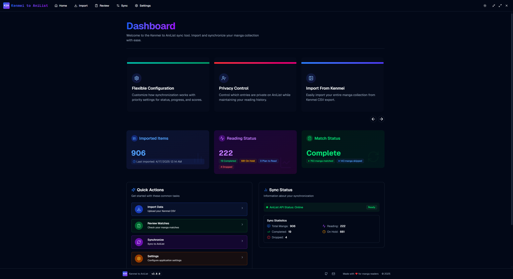
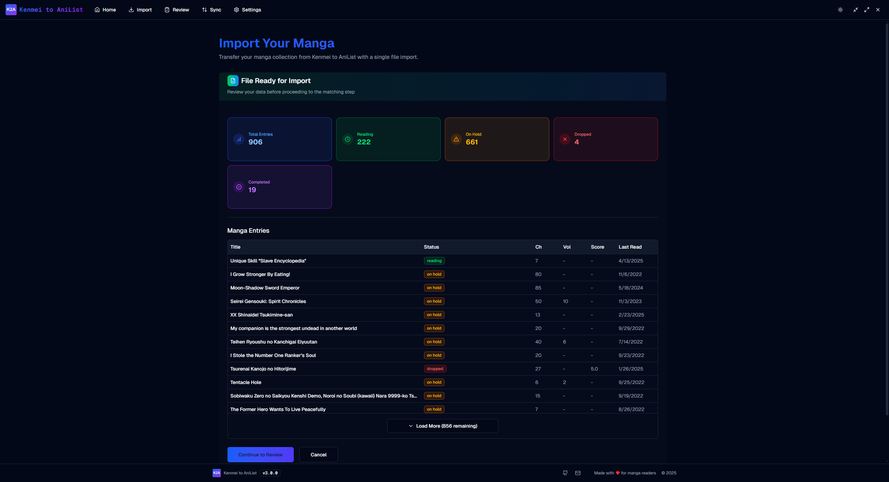
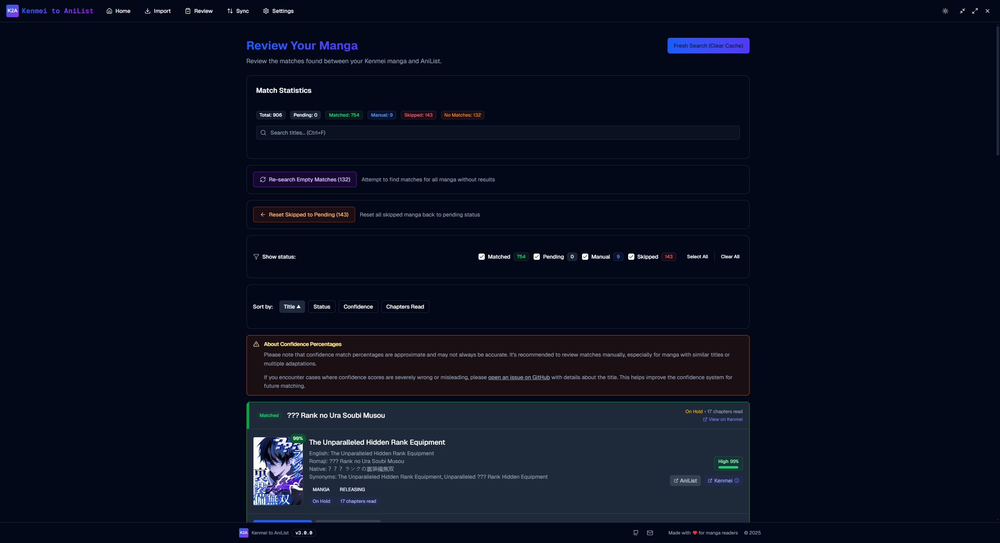
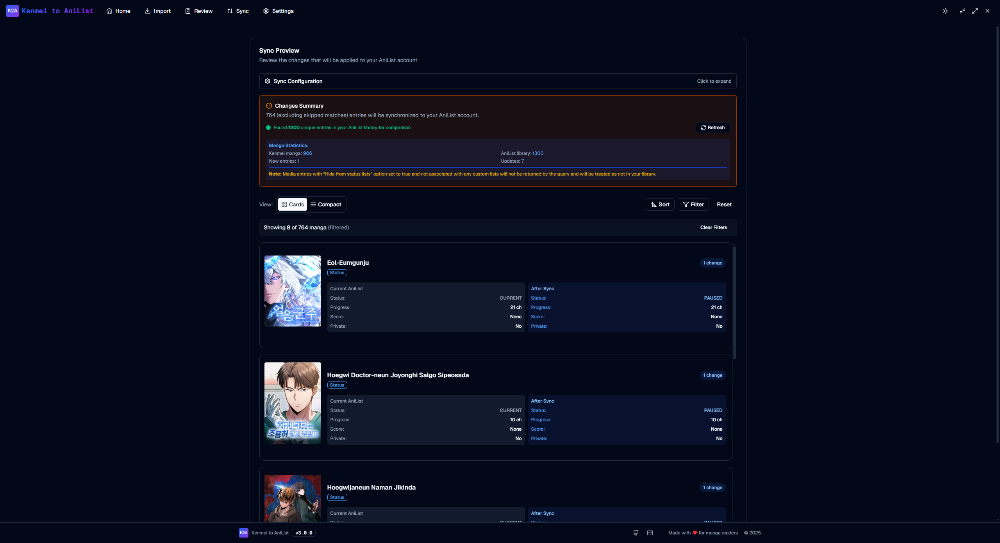
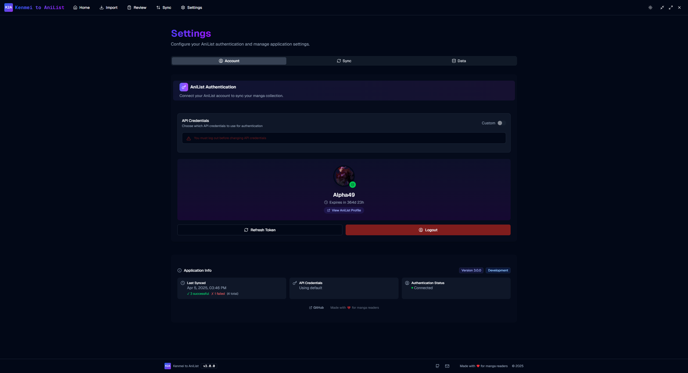

<div style="text-align: center;">
  
</div>

# Kenmei to Anilist

> Effortlessly migrate and synchronize your manga library from Kenmei to AniList with a beautiful, modern desktop app. 🚀

---

## 📸 Screenshots

- **Home Page**  
  
- **Import Kenmei CSV**  
  
- **Smart Matching**  
  
- **Sync to AniList**  
  
- **Settings**  
  

---

## ✨ Features

- **Import from Kenmei**: Easily import your entire manga collection from a Kenmei CSV export.
- **Smart Matching**: An algorithm matches your manga to AniList entries.
- **One-Click Sync**: Synchronize your collection to AniList with a single click after reviewing matches.
- **Auto-Pause Manga**: Automatically pause manga that haven't been updated within a customizable time period.
- **Flexible Configuration**: Customize how synchronization works with priority settings for status, progress, and scores.
- **Modern UI/UX**: Built with React, TailwindCSS, and Radix UI for a beautiful, accessible experience.

---

## 🛠️ How It Works

1. **Import**: Export your manga library from Kenmei as a CSV and import it into the app.
2. **Match**: The app automatically matches your manga to AniList entries. Review and adjust matches as needed.
3. **Review**: See a summary of your collection and any issues before syncing.
4. **Sync**: With one click, sync your collection to AniList, including status, progress, and privacy settings.

---

## 🚀 Getting Started

### Prerequisites

- [Node.js](https://nodejs.org/) (v18+ recommended)
- [npm](https://www.npmjs.com/) or [yarn](https://yarnpkg.com/)

### Installation

```bash
# Clone the repository
git clone https://github.com/RLAlpha49/KenmeiToAnilist.git
cd KenmeiToAnilist

# Install dependencies
npm install --force
# or
yarn install
```

### Running the App (Development)

```bash
npm start
# or
yarn start
```

### Building for Production

```bash
npm run make
# or
yarn make
```

### Environment Variables

Create a `.env` file in the root if you want to override AniList credentials:

```env
VITE_ANILIST_CLIENT_ID=your-client-id
VITE_ANILIST_CLIENT_SECRET=your-client-secret
```

> Default values are set in `src/config/anilist.ts`. You can also configure credentials in the app's Settings page.

---

## 📦 Usage

1. **Export from Kenmei**: In Kenmei, export your manga library as a CSV file.
2. **Import in App**: Drag and drop or select your CSV file in the Import page.
3. **Review & Match**: The app will auto-match your manga. Review and adjust any mismatches.
4. **Sync to AniList**: Click sync to update your AniList library.
5. **Configure Settings**: Adjust sync options, privacy, and credentials in the Settings page.

---

## 🏗️ Tech Stack

- **Electron** – Desktop app framework
- **React** – UI library
- **TypeScript** – Type safety
- **TailwindCSS** – Utility-first CSS
- **Radix UI** – Accessible UI primitives
- **Vite** – Fast build tool
- **Vitest** – Unit testing
- **Playwright** – End-to-end testing

---

## 🧪 Testing

- **Unit Tests**: `npm run test:unit` or `yarn test:unit`
- **E2E Tests**: `npm run test:e2e` or `yarn test:e2e`
- **All Tests**: `npm run test:all` or `yarn test:all`
- **Coverage**: `npm run test:coverage`

---

## 🤝 Contributing

Contributions are welcome! Please:

- Fork the repo and create your branch
- Follow the code style
- Open a pull request with a clear description
- For major changes, open an issue first to discuss

---

## 📄 License

This project is licensed under the MIT License. See [LICENSE](./LICENSE) for details.
