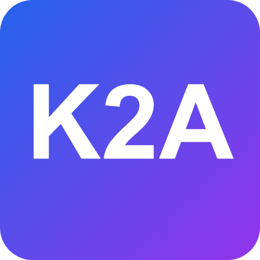
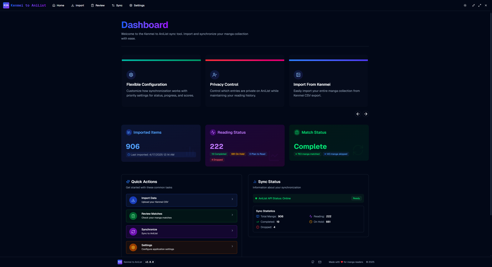
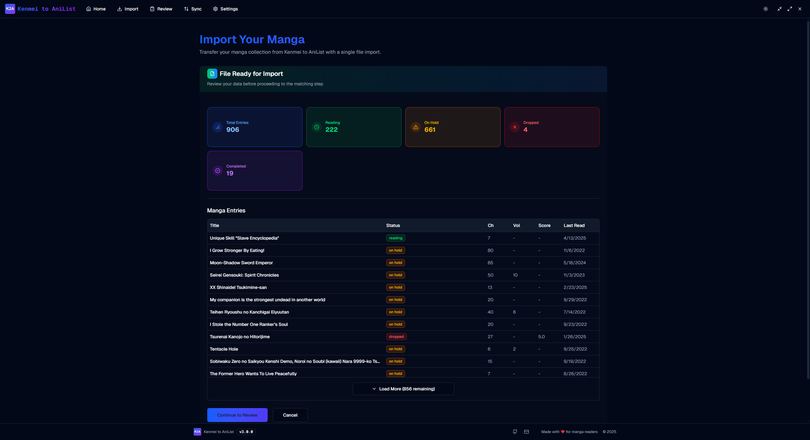
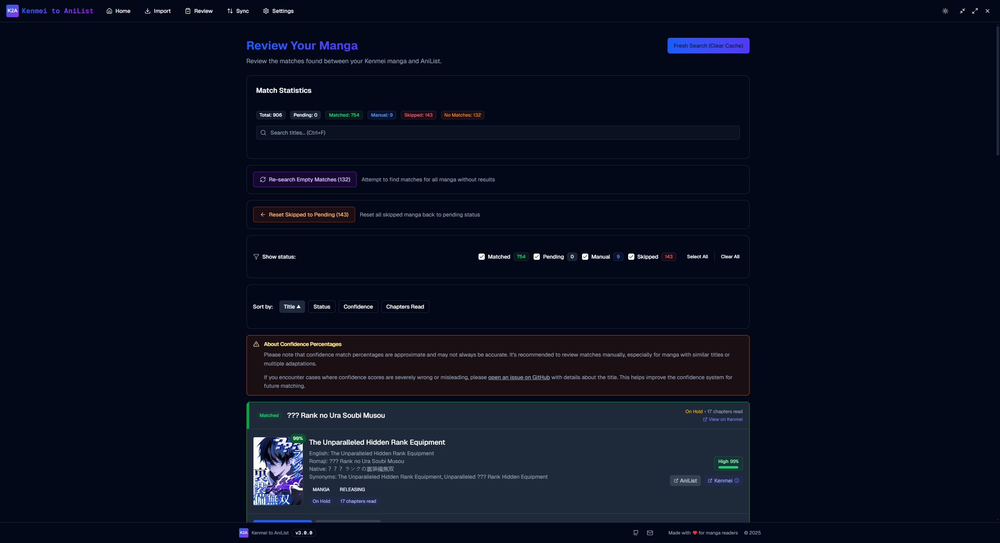
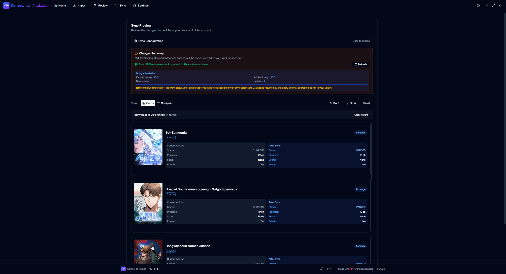
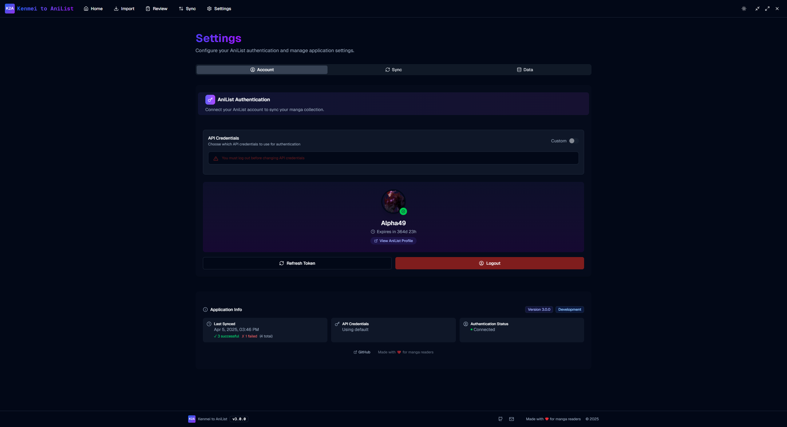

<div align=center>
  
</div>

# Kenmei to Anilist

> Effortlessly migrate and synchronize your manga library from Kenmei to AniList with a beautiful, modern desktop app. 🚀

---

## 📸 Screenshots

- **Home Page**  
  
- **Import Kenmei CSV**  
  
- **Smart Matching**  
  
- **Sync to AniList**  
  
- **Settings**  
  

---

## ✨ Features

- **Import from Kenmei**: Easily import your entire manga collection from a Kenmei CSV export.
- **Smart Matching**: An algorithm matches your manga to AniList entries.
- **One-Click Sync**: Synchronize your collection to AniList with a single click after reviewing matches.
- **Auto-Pause Manga**: Automatically pause manga that haven't been updated within a customizable time period.
- **Flexible Configuration**: Customize how synchronization works with priority settings for status, progress, and scores.
- **Automatic Updates**: Stay up-to-date with automatic update checking and seamless installation via GitHub releases.

---

## 🛠️ How It Works

1. **Import**: Export your manga library from Kenmei as a CSV and import it into the app.
2. **Match**: The app automatically matches your manga to AniList entries. Review and adjust matches as needed.
3. **Review**: See a summary of your collection and any issues before syncing.
4. **Sync**: With one click, sync your collection to AniList, including status, progress, and privacy settings.

---

## 🚀 Getting Started

### Prerequisites

- [Node.js](https://nodejs.org/) (v18+ recommended)
- [npm](https://www.npmjs.com/) or [yarn](https://yarnpkg.com/)

### Installation

```bash
# Clone the repository
git clone https://github.com/RLAlpha49/KenmeiToAnilist.git
cd KenmeiToAnilist

# Install dependencies
npm install --force
# or
yarn install
```

### Running the App (Development)

```bash
npm start
# or
yarn start
```

### Building for Production

```bash
npm run make
# or
yarn make
```

### Environment Variables

Create a `.env` file in the root if you want to set the default AniList credentials:

```env
VITE_ANILIST_CLIENT_ID=your-client-id
VITE_ANILIST_CLIENT_SECRET=your-client-secret
```

> You can also configure credentials in the app's Settings page.

---

## 📚 Documentation

### For Users

- **[User Guide](./docs/guides/USER_GUIDE.md)** – How to use the application

### For Developers

- **[Contributing Guide](./CONTRIBUTING.md)** – How to contribute to the project
- **[Architecture Documentation](./docs/guides/ARCHITECTURE.md)** – Technology choices, processes, structure, performance & security
- **[Storage Implementation Guide](./docs/guides/STORAGE_IMPLEMENTATION.md)** – Three‑layer storage architecture details
- **[AniList API Reference](./docs/guides/API_REFERENCE.md)** – GraphQL operations, auth, rate limiting, error handling
- **[Auto-Update System](./docs/guides/AUTO_UPDATE.md)** – Update system architecture, configuration, and development guide

### Generated API (TypeDoc)

- **[TypeDoc Site](https://rlalpha49.github.io/KenmeiToAnilist/)** – Auto‑generated source/API docs

---

## 🙏 Credits

This project makes use of several external APIs and services:

- **[AniList](https://anilist.co/)** – The primary manga database and sync target.
- **[MangaDex](https://mangadex.org/)** – Used as a fallback source.
- **[Comick](https://comick.io/)** – Used as a fallback source.

---

## 🤝 Contributing

We welcome contributions from the community! Whether you're fixing bugs, adding features, improving documentation, or suggesting ideas, your help is appreciated.

This project follows [Conventional Commits](https://www.conventionalcommits.org/) for commit messages, enabling automatic changelog generation and semantic versioning.

### Quick Links

- [Contributing Guide](./CONTRIBUTING.md) - Setup, coding standards, PR process
- [Commit Message Guidelines](./CONTRIBUTING.md#commit-message-guidelines) - Conventional commits format
- [Bug Report Template](./.github/ISSUE_TEMPLATE/bug_report.yml) - Report bugs
- [Architecture Documentation](./docs/guides/ARCHITECTURE.md) - Understand the codebase

### Development Quick Start

```bash
# Fork and clone the repository
git clone https://github.com/YOUR_USERNAME/KenmeiToAnilist.git
cd KenmeiToAnilist

# Install dependencies
npm install --force

# Run in development mode
npm start

# Before committing (runs automatically via Husky)
npm run precommit

# Commit your changes using conventional commits format
git commit -m "feat(scope): description of your changes"

# See CONTRIBUTING.md for commit message guidelines
```

For detailed instructions, see [CONTRIBUTING.md](./CONTRIBUTING.md).

---

## 📄 License

This project is licensed under the MIT License. See [LICENSE](./LICENSE) for details.
