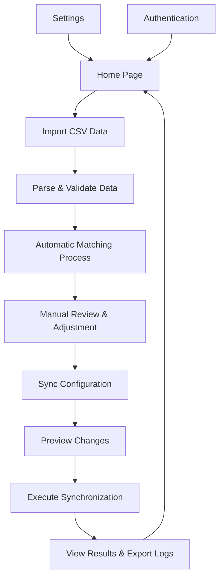

# Architecture Documentation

This document provides a comprehensive overview of the Kenmei to AniList application architecture, covering the technology stack, application structure, data flow, and key design patterns.

## 📋 Table of Contents

- [Overview](#-overview)
- [Technology Stack](#️-technology-stack)
- [Application Architecture](#️-application-architecture)
- [Process Architecture](#️-process-architecture)
- [Component Architecture](#-component-architecture)
- [Data Flow & State Management](#-data-flow--state-management)
- [Storage Architecture](#-storage-architecture)
- [API Integration](#-api-integration)
- [Build & Deployment](#-build--deployment)
- [Security Considerations](#-security-considerations)
- [Performance Optimizations](#-performance-optimizations)

## 🔎 Overview

Kenmei to AniList is a cross-platform desktop application built with Electron that enables users to migrate and synchronize their manga library from Kenmei to AniList.

### Key Architectural Principles

- **Security First**: Context isolation and controlled IPC communication
- **Performance**: Three-layer caching strategy and optimized React rendering
- **Maintainability**: Modular component structure and clear separation of concerns
- **User Experience**: Responsive design with smooth animations and error handling
- **Cross-Platform**: Consistent behavior across Windows, macOS, and Linux

### Quick Reference: Key Concepts

| Concept | What It Is | Where It Matters |
|---------|-----------|-----------------|
| **Context Bridge** | Secure IPC layer between main/renderer | `src/helpers/ipc/context-exposer.ts` |
| **Three-Layer Storage** | In-memory → localStorage → Electron Store | `src/utils/storage.ts` |
| **React Context** | Global state for auth, theme, rate limits | `src/contexts/` |
| **GraphQL API** | AniList data operations and authentication | `src/api/anilist/` |
| **OAuth 2.0** | Secure user authentication flow | `src/contexts/AuthContext.tsx` |

## 🛠️ Technology Stack

### Core Framework

- **Electron** - Desktop app framework with Chromium and Node.js
- **React** - UI library with React Compiler optimization
- **TypeScript** - Type safety and development experience
- **Vite** - Fast build tool and development server

### UI & Styling

- **TailwindCSS 4.1.13** - Utility-first CSS framework with @tailwindcss/vite plugin
- **Radix UI** - Accessible, unstyled UI primitives  
- **Lucide React** - Consistent icon library with 1000+ icons
- **Framer Motion** - Declarative animation library for smooth page transitions
- **shadcn/ui** - Pre-built, customizable components using Radix UI primitives

### State Management & Routing

- **TanStack Router** - Type-safe, file-based client-side routing with nested layouts
- **React Context** - Global state management for authentication, themes, rate limiting, and debug mode
- **Custom Hooks** - Encapsulated logic for authentication, synchronization, and rate limiting
- **Multi-layer Caching** - Three-tier storage system with automatic synchronization

### Storage & Data

- **electron-store** - Encrypted, persistent file-based storage for sensitive data
- **localStorage** - Browser-based storage for fast access and compatibility
- **In-memory cache** - Runtime performance optimization with automatic invalidation
- **Automatic Synchronization** - Seamless data consistency across all storage layers

### Development & Build Tools

- **Electron Forge** - Complete toolchain for building, packaging, and distributing
- **ESLint 9.35** - Modern linting with React Compiler plugin support
- **Prettier** - Consistent code formatting with automatic integration
- **TypeDoc** - Comprehensive API documentation generation from TypeScript comments
- **React Compiler** - Experimental automatic optimization plugin (Babel)

### External APIs

- **AniList GraphQL API** - Manga database and user list management

## 🏗️ Application Architecture

### High-Level Architecture

```text
┌─────────────────────────────────────────────────────────────┐
│                    Electron Application                     │
├─────────────────────────────────────────────────────────────┤
│  Main Process              │       Renderer Process         │
│  ├─ Window Management      │       ├─ React Application     │
│  ├─ IPC Handlers           │       ├─ UI Components         │
│  ├─ File System            │       ├─ State Management      │
│  ├─ Network Requests       │       └─ User Interactions     │
│  ├─ Storage (Store)        │                                │
│  └─ Authentication         │                                │
├─────────────────────────────────────────────────────────────┤
│                      Context Bridge                         │
│                (Secure IPC Communication)                   │
├─────────────────────────────────────────────────────────────┤
│                   External Services                         │
│                   └─ AniList GraphQL API                    │
└─────────────────────────────────────────────────────────────┘
```

### Directory Structure

```text
src/
├── main.ts                 # Main process entry point
├── preload.ts             # Preload script (context bridge setup)
├── renderer.ts            # Renderer process entry point
├── App.tsx                # React application root
├── types.d.ts             # Global type declarations
│
├── api/                   # API integration modules
│   ├── anilist/          # AniList API client and utilities
│   │   ├── client.ts     # Main API client functions
│   │   ├── queries.ts    # GraphQL queries
│   │   ├── mutations.ts  # GraphQL mutations
│   │   └── types.ts      # AniList type definitions
│   ├── kenmei/           # Kenmei data processing
│   │   ├── parser.ts     # CSV parsing logic
│   │   └── types.ts      # Kenmei type definitions
│   ├── matching/         # Manga matching algorithms
│   │   ├── match-engine.ts         # Core matching logic
│   │   ├── manga-search-service.ts # Search and caching
│   │   └── enhanced-similarity.ts  # Similarity algorithms
│   └── sync/             # Synchronization services
│       ├── anilist-sync-service.ts  # Sync operations
│       └── anilist-mutations.ts     # Update mutations
│
├── components/           # React components
│   ├── ui/              # Reusable UI components (shadcn/ui)
│   ├── layout/          # Layout components
│   ├── import/          # Import-specific components
│   ├── matching/        # Matching-specific components
│   ├── sync/            # Sync-specific components
│   └── debug/           # Debug and development tools
│
├── contexts/            # React Context providers
│   ├── AuthContext.tsx       # Authentication state
│   ├── ThemeContext.tsx      # Theme management  
│   ├── RateLimitContext.tsx  # API rate limiting
│   └── DebugContext.tsx      # Debug mode state
│
├── helpers/             # Utility functions and IPC setup
│   ├── ipc/            # Inter-process communication
│   │   ├── api/        # API-related IPC handlers
│   │   ├── auth/       # Authentication IPC handlers
│   │   └── store/      # Storage IPC handlers
│   └── *.ts            # General helper functions
│
├── hooks/              # Custom React hooks
├── pages/              # Application pages/routes
│   ├── HomePage.tsx         # Dashboard and overview
│   ├── ImportPage.tsx       # CSV import functionality
│   ├── MatchingPage.tsx     # Manga matching interface
│   ├── SyncPage.tsx         # Sync preview and execution
│   └── SettingsPage.tsx     # App configuration
├── routes/             # TanStack Router configuration
├── styles/             # Global styles and themes
├── types/              # TypeScript type definitions
└── utils/              # Utility functions
    ├── storage.ts           # Storage abstraction layer
    ├── app-version.ts       # Version checking
    └── enhanced-similarity.ts # String matching algorithms
```

## ⚙️ Process Architecture

### Main Process (`src/main.ts`)

The main process is responsible for:

- **Application Lifecycle**: Window creation, app initialization, and cleanup
- **IPC Management**: Registering event listeners for renderer communication
- **Security**: Handling sensitive operations (file system, network, authentication)
- **System Integration**: Native OS features and notifications

```typescript
// Main process responsibilities
app.whenReady().then(createWindow).then(installExtensions);

function createWindow() {
  const mainWindow = new BrowserWindow({
    webPreferences: {
      contextIsolation: true, // Security isolation
      nodeIntegration: true, // Node.js access in main
      nodeIntegrationInSubFrames: false,
      preload: preload, // Preload script path
    },
  });

  registerListeners(mainWindow); // Setup IPC handlers
}
```

### Preload Script (`src/preload.ts`)

The preload script bridges main and renderer processes securely:

- **Context Bridge**: Exposes limited, safe APIs to renderer
- **IPC Abstraction**: Wraps complex IPC patterns in simple interfaces
- **Security Layer**: Prevents direct Node.js access from renderer

```typescript
// Preload exposes secure APIs
exposeContexts(); // Sets up all context bridges

// Example context bridge
contextBridge.exposeInMainWorld("electronStore", {
  getItem: (key: string) => ipcRenderer.invoke("store:getItem", key),
  setItem: (key: string, value: string) =>
    ipcRenderer.invoke("store:setItem", key, value),
});
```

### Renderer Process (`src/renderer.ts` → `src/App.tsx`)

The renderer process handles all UI and user interactions:

- **React Application**: Component tree and state management
- **User Interface**: All visual elements and user interactions
- **Client-Side Logic**: Data processing and validation
- **API Consumption**: Using exposed IPC APIs

```typescript
// Renderer process setup
export default function App() {
  return (
    <ThemeProvider>
      <DebugProvider>
        <AuthProvider>
          <RateLimitProvider>
            <RouterProvider router={router} />
            <SonnerProvider />
          </RateLimitProvider>
        </AuthProvider>
      </DebugProvider>
    </ThemeProvider>
  );
}
```

## 🧩 Component Architecture

### Component Hierarchy

```text
App (Root)
├── ThemeProvider
├── DebugProvider
├── AuthProvider
├── RateLimitProvider
└── RouterProvider
    └── BaseLayout
        ├── Header (Navigation)
        ├── Main Content (Route Outlet)
        │   ├── HomePage
        │   ├── ImportPage
        │   ├── MatchingPage
        │   ├── SyncPage
        │   └── SettingsPage
        └── Footer
```

### Context Providers

#### AuthProvider (`src/contexts/AuthContext.tsx`)

- Manages authentication state and user sessions
- Handles OAuth flow with AniList
- Provides authentication status across the app
- Exposes login/logout functions

#### ThemeProvider (`src/contexts/ThemeContext.tsx`)

- Manages dark/light/system theme preferences
- Synchronizes with OS theme changes
- Persists theme selection in storage
- Provides theme toggle functionality

#### RateLimitProvider (`src/contexts/RateLimitContext.tsx`)

- Tracks AniList API rate limit status
- Implements backoff strategies
- Provides rate limit information to components
- Handles rate limit recovery

#### DebugProvider (`src/contexts/DebugContext.tsx`)

- Manages debug mode state
- Controls development tool visibility
- Provides debug information to developers

### Routing Architecture

The application uses TanStack Router for type-safe, declarative routing:

```typescript
// Current route structure
export const routeTree = rootRoute.addChildren([
  indexRoute,        // '/'      - HomePage dashboard
  importRoute,       // '/import' - CSV import functionality  
  reviewRoute,       // '/review' - Manga matching interface
  syncRoute,         // '/sync'   - Sync preview and execution
  settingsRoute,     // '/settings' - App configuration
]);

// Route definitions with lazy loading
const importRoute = createRoute({
  getParentRoute: () => rootRoute,
  path: '/import',
  component: ImportPage,
});

// Type-safe navigation
function navigateToSync() {
  navigate({ to: '/sync' });
}
```

### Page Components

#### HomePage (`src/pages/HomePage.tsx`)

- **Purpose**: Dashboard with statistics, quick actions, and sync status
- **Features**: Import stats, match results summary, version checking
- **Key State**: Authentication status, import statistics, version info
- **Navigation**: Links to all major app functions

#### ImportPage (`src/pages/ImportPage.tsx`)

- **Purpose**: CSV file import and validation
- **Features**: Drag & drop upload, file validation, data preview
- **Key State**: File upload progress, parsing results, error handling
- **Data Flow**: Parses CSV → Validates format → Saves to storage

#### MatchingPage (`src/pages/MatchingPage.tsx`)

- **Purpose**: Manga matching interface with manual review capabilities
- **Features**: Automatic matching, manual search, confidence scoring, batch selection
- **Key State**: Match results, search progress, user selections, batch selection state
- **Integration**: Uses matching algorithms, AniList search, storage persistence

#### SyncPage (`src/pages/SyncPage.tsx`)

- **Purpose**: Synchronization preview, configuration, and execution
- **Features**: Sync preview, configuration options, progress monitoring
- **Key State**: Sync configuration, user library, sync progress
- **Workflow**: Preview → Configure → Execute → Results

#### SettingsPage (`src/pages/SettingsPage.tsx`)

- **Purpose**: Application configuration and authentication
- **Features**: AniList credentials, theme selection, matching configuration
- **Key State**: Authentication state, app preferences, API credentials

## 📊 Data Flow & State Management

### State Management Strategy

The application uses a hybrid approach combining multiple state management patterns:

```text
┌─────────────────┐    ┌─────────────────┐    ┌─────────────────┐
│   React Context │    │  Custom Caching │    │  Local Storage  │
│                 │    │                 │    │                 │
│ • Authentication│    │ • API Response  │    │ • Preferences   │
│ • Theme State   │    │   Caching       │    │ • User Data     │
│ • Debug Mode    │    │ • Three-Layer   │    │ • Cache Layer   │
│ • Rate Limits   │    │   Storage       │    │                 │
└─────────────────┘    └─────────────────┘    └─────────────────┘
        │                       │                       │
        └───────────────────────┼───────────────────────┘
                                │
                       ┌─────────────────┐
                       │  Component Tree │
                       │                 │
                       │ • UI State      │
                       │ • Form Data     │
                       │ • Interactions  │
                       └─────────────────┘
```

#### Global State (React Context)

- **Authentication**: User login status, tokens, credentials
- **Theme**: Current theme preference (dark/light/system)
- **Debug**: Development mode, debug panel visibility  
- **Rate Limiting**: API quota status, retry timers

#### Custom Caching System

- **API Response Caching**: Intelligent cache management for AniList API responses
- **Storage Synchronization**: Three-layer cache system (in-memory → localStorage → Electron Store)
- **Background Operations**: Asynchronous API calls with automatic cache invalidation

#### Persistent State (Storage)

- **User Preferences**: Settings, configuration options
- **Import Data**: CSV data, matching results, sync history
- **Authentication**: Stored credentials and tokens (encrypted)

### Data Flow Patterns

#### Import Flow

```text
1. User selects CSV file
2. File validation (renderer)
3. Parse CSV data (renderer)
4. Store import data (storage)
5. Auto-match with AniList (API)
6. Update match results (storage)
7. Display review interface (UI)
```

#### Sync Flow

```text
1. User initiates sync
2. Batch preparation (renderer)
3. Rate limit check (context)
4. API requests (main process)
5. Progress tracking (context)
6. Error handling (context)
7. Results storage (storage)
8. UI updates (component state)
```

## 💾 Storage Architecture

The application implements a sophisticated three-layer storage system for optimal performance and data consistency. For complete details, see [Storage Implementation Guide](./STORAGE_IMPLEMENTATION.md).

### Storage Layers

```text
┌─────────────────┐
│  In-Memory      │  ← Runtime cache, fastest access
│  Cache          │    Cleared on app restart
│  (storageCache) │
└─────────────────┘
         ↕ Sync
┌─────────────────┐
│  localStorage   │  ← Browser storage, fast access
│  (Browser API)  │    Persists during session
└─────────────────┘
         ↕ Sync
┌─────────────────┐
│  Electron Store │  ← File-based, authoritative
│ (electron-store)│    Persists across app restarts
└─────────────────┘    **PRIMARY SOURCE OF TRUTH**
```

### Storage Precedence

1. **Electron Store** - Authoritative source, file-based persistence
2. **localStorage** - Fast cache, overwritten by Electron Store on conflicts
3. **In-Memory Cache** - Fastest access, synchronized with other layers

### IPC Bridge for Storage

```typescript
// Context bridge exposes storage APIs
contextBridge.exposeInMainWorld("electronStore", {
  getItem: (key: string) => ipcRenderer.invoke("store:getItem", key),
  setItem: (key: string, value: string) =>
    ipcRenderer.invoke("store:setItem", key, value),
  removeItem: (key: string) => ipcRenderer.invoke("store:removeItem", key),
  clear: () => ipcRenderer.invoke("store:clear"),
});

// Main process handlers
ipcMain.handle("store:getItem", (_, key) => store.get(key, null));
ipcMain.handle("store:setItem", (_, key, value) => store.set(key, value));
```

## 🌐 API Integration

### AniList GraphQL Integration

The application integrates with AniList's GraphQL API v2 for all manga-related operations:

```text
┌─────────────────┐    ┌─────────────────┐    ┌─────────────────┐
│   Renderer      │    │   Main Process  │    │   AniList API   │
│   Process       │    │                 │    │                 │
│                 │    │                 │    │                 │
│ ┌─────────────┐ │    │ ┌─────────────┐ │    │ ┌─────────────┐ │
│ │ Components  │─┼────┼→│ IPC Handler │─┼────┼→│ GraphQL     │ │
│ │             │ │    │ │             │ │    │ │ Endpoint    │ │
│ └─────────────┘ │    │ └─────────────┘ │    │ └─────────────┘ │
│                 │    │                 │    │                 │
│ ┌─────────────┐ │    │ ┌─────────────┐ │    │ ┌─────────────┐ │
│ │ TanStack    │←┼────┼─│ Response    │←┼────┼─│ Response    │ │
│ │ Query       │ │    │ │ Handler     │ │    │ │ Data        │ │
│ └─────────────┘ │    │ └─────────────┘ │    │ └─────────────┘ │
└─────────────────┘    └─────────────────┘    └─────────────────┘
```

### Authentication Flow

The application uses OAuth 2.0 for secure AniList authentication:

```text
1. User clicks "Connect AniList Account" 
2. App opens OAuth window with AniList authorization URL
3. User authorizes the application
4. AniList redirects with authorization code
5. Main process exchanges code for access token via IPC
6. Token stored securely in Electron Store
7. User profile fetched and stored in authentication context
8. App navigates to authenticated state
```

## 🔄 Application Workflow

### Complete User Journey

The application follows a structured workflow from import to synchronization:



#### Data Processing Pipeline

1. **Import Phase**
   - CSV file validation and parsing
   - Kenmei data normalization
   - Storage in three-layer system

2. **Matching Phase**
   - Automatic search using enhanced similarity algorithms
   - Confidence scoring based on multiple factors
   - Manual search and selection interface
   - Results persistence with user modifications

3. **Synchronization Phase**
   - User library fetching with rate limit handling
   - Change preview with configuration options
   - Batch processing with incremental sync support
   - Error handling and retry mechanisms

4. **Results Phase**
   - Comprehensive sync reporting
   - Error log export functionality
   - Statistics tracking and storage

## 🚀 Performance Optimizations

### Multi-layer Caching Strategy

```typescript
// Three-tier caching implementation
export const storage = {
  // Level 1: In-memory cache (fastest)
  getItem: (key: string) => {
    if (key in storageCache) return storageCache[key];
    
    // Level 2: localStorage (fast)
    const value = localStorage.getItem(key);
    if (value !== null) storageCache[key] = value;
    
    // Level 3: Electron Store (authoritative, async check)
    if (globalThis.electronStore) {
      globalThis.electronStore.getItem(key).then(electronValue => {
        if (electronValue !== null && electronValue !== value) {
          localStorage.setItem(key, electronValue);
          storageCache[key] = electronValue;
        }
      });
    }
    
    return value;
  }
};
```

### API Optimization Techniques

- **Request Batching**: Group multiple manga lookups into single API calls
- **Intelligent Caching**: 30-minute cache expiration with manual invalidation
- **Rate Limit Handling**: Automatic retry with exponential backoff
- **Abort Signal Support**: Cancel in-flight requests during navigation
- **Cache Bypass Options**: Force fresh data when needed

### React Performance

- **React Compiler**: Experimental automatic optimization (babel-plugin-react-compiler)
- **Code Splitting**: Lazy loading for non-critical components
- **Virtualization**: Large list rendering optimization (planned)
- **Memoization**: Strategic use of useMemo and useCallback for expensive operations

### Security Architecture

#### Secure Authentication Storage

- **Credential Encryption**: OAuth credentials stored in Electron Store with platform encryption
- **Token Management**: Access tokens managed through secure IPC channels
- **No Direct File Access**: Renderer process cannot access filesystem directly

## 🔧 Build & Deployment

### Development Workflow

```bash
# Development server with hot reload
npm start

# Type checking
npm run lint

# Documentation generation  
npm run docs

# Package for distribution
npm run make
```

### Build Configuration

- **Electron Forge**: Complete build pipeline with platform-specific packaging
- **Vite Configuration**: Separate configs for main, preload, and renderer processes
- **TypeScript**: Strict type checking with path mapping for clean imports
- **Asset Optimization**: Automatic code splitting and tree shaking

### Distribution

- **Windows**: Squirrel installer (.exe)
- **macOS**: DMG installer with code signing
- **Linux**: DEB and AppImage packages
- **Auto-updater**: Built-in update mechanism (planned)
- **Intelligent invalidation**: Manual clearing with title-specific targeting

## 🔒 Security Considerations

### Electron Security Best Practices

```typescript
// Main window security configuration
new BrowserWindow({
  webPreferences: {
    contextIsolation: true, // Isolate renderer context
    nodeIntegration: true, // Node.js in main only
    nodeIntegrationInSubFrames: false, // No Node.js in subframes
    preload: preload, // Controlled API exposure
  },
});
```

### Context Isolation

The application maintains strict separation between main and renderer processes:

- **No Direct Node.js Access**: Renderer cannot access Node.js APIs directly
- **Controlled IPC**: All communication via secured context bridge
- **Limited API Surface**: Only necessary functions exposed to renderer

### Data Security

- **Credential Storage**: OAuth tokens encrypted in Electron Store
- **API Keys**: Default credentials can be overridden securely
- **Local Data**: CSV imports and sync data stored locally only
- **No Data Transmission**: Personal data never leaves user's device except for AniList API

### Network Security

- **HTTPS Only**: All external API calls use HTTPS
- **Certificate Validation**: Standard certificate validation enforced
- **OAuth 2.0**: Industry-standard authentication protocol
- **Token Management**: Automatic token refresh and secure storage

## ⚡ Performance Optimizations

### React Optimizations

- **React Compiler**: Automatic optimization of component renders
- **Lazy Loading**: Route-based code splitting
- **Memoization**: Strategic use of `useMemo` and `useCallback`
- **Virtual Scrolling**: For large manga lists

### Electron Optimizations

- **Process Isolation**: Main and renderer processes separated
- **Memory Management**: Garbage collection and memory monitoring
- **Asset Optimization**: Image compression and lazy loading
- **Background Processing**: Heavy operations in main process

### Storage Optimizations

- **Three-Layer Caching**: In-memory → localStorage → Electron Store
- **Batch Operations**: Grouping storage operations for efficiency
- **Selective Sync**: Only sync changed data between storage layers
- **Compression**: Large JSON objects compressed before storage

### API Optimizations

- **Request Batching**: Multiple operations in single GraphQL request
- **Response Caching**: Custom cache management with manual invalidation
- **Rate Limit Respect**: Automatic backoff and retry strategies
- **Background Updates**: Non-blocking API calls where possible

### Bundle Optimizations

- **Code Splitting**: Separate bundles for main, preload, and renderer
- **Tree Shaking**: Remove unused code from final bundle
- **Asset Optimization**: Compress images and minimize bundle size
- **Dynamic Imports**: Load components only when needed
