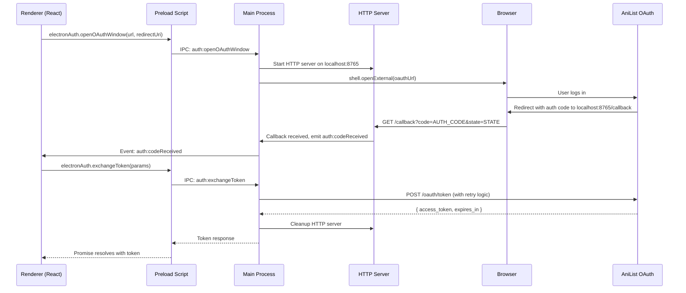
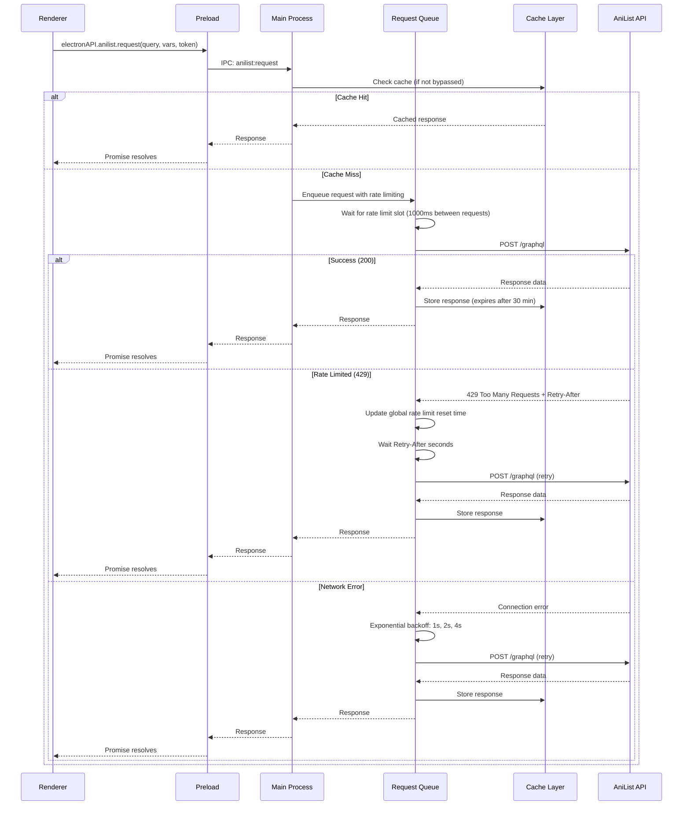
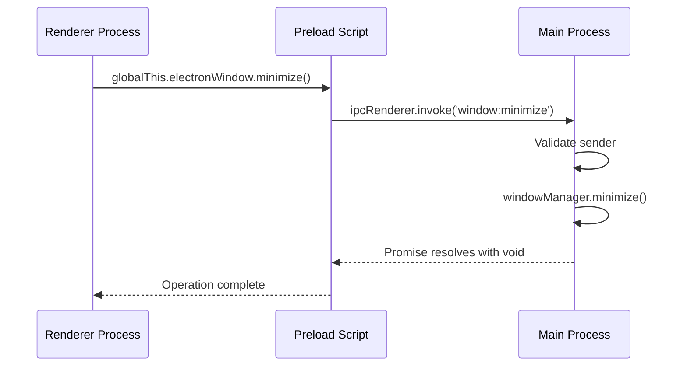
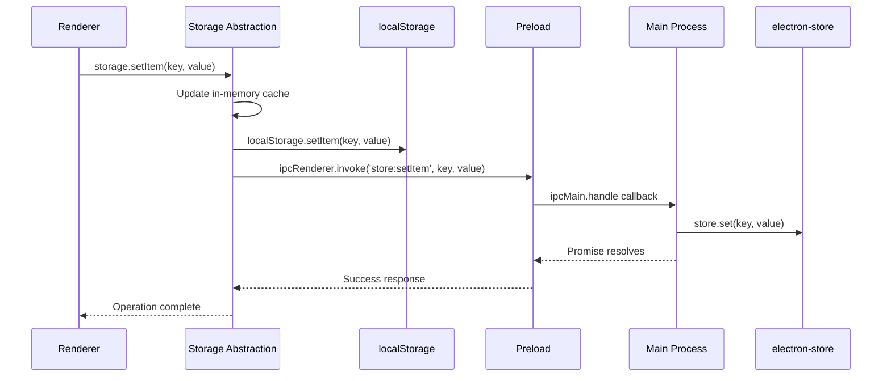

# IPC Architecture Guide

## Overview

Electron applications run in two main processes: the **main process** (Node.js environment with access to the file system, native modules, and system APIs) and the **renderer process** (Chromium-based browser environment running the UI). These processes are completely isolated for security reasons, but need to communicate to perform operations.

In this application, communication between the renderer (React UI) and main process (Electron) is handled through **Inter-Process Communication (IPC)** via a carefully designed **context bridge pattern**. This guide documents the complete IPC architecture.

### Why Context Bridge Security Model?

By default, Electron applications can expose Node.js APIs directly to the renderer, which is a serious security vulnerability. An attacker could inject malicious code into the renderer process and gain full access to the user's file system, spawn child processes, or execute arbitrary code.

The **context bridge pattern** solves this by:

1. **Context Isolation** - Renderer process cannot access Node.js directly
2. **Preload Script** - A special script that runs in the renderer's context but has access to both Node.js and IPC
3. **Controlled API Surface** - Only explicitly exposed methods are available to renderer code
4. **Input Validation** - All IPC handlers validate inputs before executing

This architecture ensures that the renderer can only perform operations that were explicitly approved by the developer.

### Five Exposed Contexts

This application exposes five distinct contexts to the renderer, each serving a specific purpose:

1. **electronWindow** - Window management (minimize, maximize, close)
2. **electronTheme** - Theme persistence and system-wide theme changes
3. **electronAuth** - OAuth authentication with browser interaction
4. **electronStore** - Persistent file-based storage via electron-store
5. **electronAPI** - AniList API requests, caching, rate limiting, and shell operations

## Context Bridge Pattern

### Architecture Overview

The context bridge architecture consists of three layers:

```text
┌─────────────────────────────────────────────────────────────┐
│  Renderer Process (React Application)                       │
│  - UI components                                            │
│  - Hooks and state management                               │
│  - globalThis.electronWindow                                │
│  - globalThis.electronTheme                                 │
│  - globalThis.electronAuth                                  │
│  - globalThis.electronStore                                 │
│  - globalThis.electronAPI                                   │
└─────────────────┬───────────────────────────────────────────┘
                  │ (Context Bridge)
┌─────────────────▼───────────────────────────────────────────┐
│  Preload Script (src/preload.ts)                            │
│  - Has access to both Node.js and IPC                       │
│  - Exposes sanitized API surface                            │
│  - contextBridge.exposeInMainWorld()                        │
└─────────────────┬───────────────────────────────────────────┘
                  │ (ipcRenderer & ipcMain)
┌─────────────────▼───────────────────────────────────────────┐
│  Main Process (Node.js Environment)                         │
│  - HTTP server                                              │
│  - File system operations                                   │
│  - External API calls                                       │
│  - Window management                                        │
│  - IPC event handlers                                       │
└─────────────────────────────────────────────────────────────┘
```

### Key Components

#### src/preload.ts

The preload script is executed before the renderer loads. It orchestrates the exposure of all contexts:

```typescript
// Preload script runs with access to both Node.js (via require) and IPC
// It exposes a sanitized API surface to the renderer

contextBridge.exposeInMainWorld('electronWindow', { ... });
contextBridge.exposeInMainWorld('electronTheme', { ... });
// etc.
```

#### src/helpers/ipc/context-exposer.ts

The central registration point that imports and combines all context definitions:

```typescript
// context-exposer.ts handles the registration logic
import { exposeWindowContext } from './window/window-context';
import { exposeThemeContext } from './theme/theme-context';
// ... import other contexts

export function exposeAllContexts() {
  exposeWindowContext();
  exposeThemeContext();
  // ... expose other contexts
}
```

#### Handler Organization

IPC handlers are organized by domain:

- `src/helpers/ipc/window/window-listeners.ts` - Window operations
- `src/helpers/ipc/theme/theme-listeners.ts` - Theme operations
- `src/helpers/ipc/auth/auth-listeners.ts` - Authentication
- `src/helpers/ipc/store/store-setup.ts` - Storage
- `src/helpers/ipc/api/api-listeners.ts` - API operations

## Exposed Contexts Reference

### 1. electronWindow - Window Management

**Purpose:** Control application window operations from the renderer

**Exposed Methods:**

```typescript
globalThis.electronWindow.minimize(): void
globalThis.electronWindow.maximize(): void
globalThis.electronWindow.close(): void
globalThis.electronWindow.toggleMaximize(): void
```

**IPC Channels:**

- `window:minimize` - Minimize the application window
- `window:maximize` - Maximize the application window
- `window:close` - Close the application window
- `window:toggleMaximize` - Toggle between normal and maximized state

**Handler Location:** `src/helpers/ipc/window/window-listeners.ts`

**Usage Example:**

```typescript
// In React component
import { useCallback } from 'react';

export function WindowControls() {
  const handleMinimize = useCallback(() => {
    globalThis.electronWindow.minimize();
  }, []);

  const handleClose = useCallback(() => {
    globalThis.electronWindow.close();
  }, []);

  return (
    <div>
      <button onClick={handleMinimize}>Minimize</button>
      <button onClick={handleClose}>Close</button>
    </div>
  );
}
```

**Security Considerations:**

- Window operations are non-destructive (no data loss)
- Safe to expose to renderer
- Sender validation in handler ensures request comes from main window

---

### 2. electronTheme - Theme Management

**Purpose:** Persist theme preference and handle system-wide theme changes

**Exposed Methods:**

```typescript
globalThis.electronTheme.getCurrentMode(): Promise<'light' | 'dark' | 'system'>
globalThis.electronTheme.toggleTheme(): Promise<'light' | 'dark' | 'system'>
globalThis.electronTheme.setDarkMode(): Promise<void>
globalThis.electronTheme.setLightMode(): Promise<void>
globalThis.electronTheme.setSystemMode(): Promise<void>
globalThis.electronTheme.onThemeChange(callback: (theme: string) => void): void
```

**IPC Channels:**

- `theme:mode:current` - Get current theme mode
- `theme:mode:toggle` - Toggle between light/dark
- `theme:mode:set` - Set specific theme (dark, light, or system)
- `theme:changed` - Event fired when theme changes

**Handler Location:** `src/helpers/ipc/theme/theme-listeners.ts`

**Event-Based Communication:**

```typescript
// In React component
import { useEffect, useState } from 'react';

export function ThemeSelector() {
  const [theme, setTheme] = useState<'light' | 'dark' | 'system'>('system');

  useEffect(() => {
    // Get current theme
    globalThis.electronTheme.getCurrentMode().then(setTheme);

    // Listen for theme changes (e.g., system preference changed)
    globalThis.electronTheme.onThemeChange((newTheme) => {
      setTheme(newTheme);
      console.log('Theme changed to:', newTheme);
    });
  }, []);

  const handleToggle = async () => {
    const newTheme = await globalThis.electronTheme.toggleTheme();
    setTheme(newTheme);
  };

  return (
    <button onClick={handleToggle}>
      Toggle Theme (current: {theme})
    </button>
  );
}
```

**Security Considerations:**

- Theme preference is stored in electron-store (protected file)
- No sensitive data exposed
- System theme detection requires native integration but is safe

---

### 3. electronAuth - OAuth Authentication

**Purpose:** Handle OAuth authentication flow with browser integration and secure credential storage

**Exposed Methods:**

```typescript
globalThis.electronAuth.openOAuthWindow(
  url: string,
  redirectUri: string
): Promise<void>

globalThis.electronAuth.storeCredentials(
  key: string,
  value: string
): Promise<void>

globalThis.electronAuth.getCredentials(
  key: string
): Promise<string | null>

globalThis.electronAuth.exchangeToken(params: {
  clientId: string;
  clientSecret: string;
  redirectUri: string;
  code: string;
}): Promise<{ access_token: string; expires_in: number }>

globalThis.electronAuth.onCodeReceived(
  callback: (code: string) => void
): void

globalThis.electronAuth.onCancelled(
  callback: () => void
): void

globalThis.electronAuth.onStatus(
  callback: (status: string) => void
): void
```

**IPC Channels:**

- `auth:openOAuthWindow` - Start OAuth flow with browser
- `auth:storeCredentials` - Store credentials in memory
- `auth:getCredentials` - Retrieve stored credentials
- `auth:cancel` - Cancel ongoing authentication
- `auth:exchangeToken` - Exchange auth code for token
- `auth:codeReceived` - Event: auth code received from browser
- `auth:cancelled` - Event: user cancelled auth
- `auth:status` - Event: authentication status update

**Handler Location:** `src/helpers/ipc/auth/auth-listeners.ts`

**OAuth Authentication Flow Diagram:**



**Usage Example:**

```typescript
// In authentication context or hook
export async function initiateOAuth(
  clientId: string,
  redirectUri: string
): Promise<string> {
  return new Promise((resolve, reject) => {
    // Handle successful code reception
    globalThis.electronAuth.onCodeReceived(async (code) => {
      try {
        const token = await globalThis.electronAuth.exchangeToken({
          clientId,
          clientSecret: ANILIST_CLIENT_SECRET,
          redirectUri,
          code,
        });

        // Store token for later use
        await globalThis.electronAuth.storeCredentials(
          'access_token',
          token.access_token
        );

        resolve(token.access_token);
      } catch (error) {
        reject(error);
      }
    });

    // Handle cancellation
    globalThis.electronAuth.onCancelled(() => {
      reject(new Error('OAuth cancelled by user'));
    });

    // Handle status updates
    globalThis.electronAuth.onStatus((status) => {
      console.log('Auth status:', status);
    });

    // Open OAuth window
    const oauthUrl = `https://anilist.co/api/v2/oauth/authorize?client_id=${clientId}&response_type=code`;
    globalThis.electronAuth.openOAuthWindow(oauthUrl, redirectUri);
  });
}
```

**Security Considerations:**

- OAuth URL is validated before opening browser (domain, protocol, parameters)
- Authorization code is captured by local HTTP server, not visible in browser history
- Token exchange happens in main process (Node.js), not renderer (no token leak risk)
- HTTP server has 2-minute timeout to prevent port occupation
- Token exchange includes retry logic for network reliability

---

### 4. electronStore - Persistent Storage

**Purpose:** Store data persistently using electron-store file backend (in addition to in-memory and localStorage)

**Exposed Methods:**

```typescript
globalThis.electronStore.getItem(key: string): Promise<string | null>
globalThis.electronStore.setItem(key: string, value: string): Promise<void>
globalThis.electronStore.removeItem(key: string): Promise<void>
globalThis.electronStore.clear(): Promise<void>
```

**IPC Channels:**

- `store:getItem` - Retrieve value from store
- `store:setItem` - Store value in file
- `store:removeItem` - Remove value from store
- `store:clear` - Clear all stored values

**Handler Location:** `src/helpers/ipc/store/store-setup.ts`

**Integration with Three-Layer Storage:**

The application uses a three-layer storage architecture:

1. **In-Memory Cache** - Fastest, lost on app restart
2. **localStorage** - Browser storage, persistent during session
3. **electron-store** - File-based storage, most persistent

```typescript
// Storage abstraction handles all three layers
import { storage, STORAGE_KEYS } from '@/utils/storage';

// Never use electron-store directly!
// Always use the storage abstraction:

// Store data (syncs to all three layers)
await storage.setItem(STORAGE_KEYS.KENMEI_DATA, JSON.stringify(data));

// Retrieve data (checks layers in order)
const data = storage.getItem(STORAGE_KEYS.KENMEI_DATA);

// The abstraction handles:
// - In-memory update
// - localStorage.setItem()
// - electronStore.setItem() via IPC
```

**Usage Example:**

```typescript
// In React component using storage abstraction
import { useEffect, useState } from 'react';
import { storage, STORAGE_KEYS } from '@/utils/storage';

export function UserDataDisplay() {
  const [userData, setUserData] = useState(null);

  useEffect(() => {
    // Load from storage
    const stored = storage.getItem(STORAGE_KEYS.USER_DATA);
    if (stored) {
      setUserData(JSON.parse(stored));
    }
  }, []);

  const handleSave = async () => {
    // Save to storage (uses all three layers)
    await storage.setItem(
      STORAGE_KEYS.USER_DATA,
      JSON.stringify(userData)
    );
  };

  return (
    <div>
      <pre>{JSON.stringify(userData, null, 2)}</pre>
      <button onClick={handleSave}>Save</button>
    </div>
  );
}
```

**Security Considerations:**

- electron-store is not encrypted by default (suitable for non-sensitive data)
- Access tokens should NOT be stored in electron-store
- User credentials stored in main process memory only (not persisted to disk)
- All access goes through IPC (no direct file system access from renderer)

---

### 5. electronAPI - AniList API & Operations

**Purpose:** Execute API requests, manage caching/rate limiting, and perform external operations

**Exposed Methods:**

```typescript
// AniList API methods
globalThis.electronAPI.anilist.request<T>(
  query: string,
  variables?: Record<string, any>,
  accessToken?: string,
  abortSignal?: AbortSignal,
  bypassCache?: boolean
): Promise<T>

globalThis.electronAPI.anilist.clearCache(
  query?: string,
  variables?: Record<string, any>
): Promise<void>

globalThis.electronAPI.anilist.getRateLimitStatus(): Promise<{
  remaining: number;
  resetAt: number;
}>

// External source operations
globalThis.electronAPI.mangaSource.search(
  title: string,
  source: 'comick' | 'mangadex'
): Promise<MangaSearchResult[]>

globalThis.electronAPI.mangaSource.getMangaDetail(
  id: string,
  source: 'comick' | 'mangadex'
): Promise<MangaDetail>

// Shell operations
globalThis.electronAPI.shell.openExternal(
  url: string
): Promise<void>
```

**IPC Channels:**

- `anilist:request` - GraphQL API request with caching
- `anilist:clearCache` - Clear search cache
- `anilist:getRateLimitStatus` - Get rate limit state
- `mangaSource:search` - Search external sources
- `mangaSource:getMangaDetail` - Get details from external source
- `shell:openExternal` - Open URL in default browser

**Handler Location:** `src/helpers/ipc/api/api-listeners.ts`

**Rate Limiting & Caching Workflow:**



**Usage Examples:**

```typescript
// Basic API request with automatic caching
const result = await globalThis.electronAPI.anilist.request(
  SEARCH_MANGA,
  { search: 'One Piece', page: 1, perPage: 10 },
  accessToken
);

// Bypass cache for fresh data
const freshResult = await globalThis.electronAPI.anilist.request(
  SEARCH_MANGA,
  { search: 'One Piece' },
  accessToken,
  undefined,
  true  // bypassCache
);

// With cancellation support
const controller = new AbortController();
const result = await globalThis.electronAPI.anilist.request(
  SEARCH_MANGA,
  { search: 'Naruto' },
  accessToken,
  controller.signal
);

// Later: abort the request
controller.abort();

// Check rate limit status
const status = await globalThis.electronAPI.anilist.getRateLimitStatus();
console.log(`Remaining requests: ${status.remaining}`);
console.log(`Reset at: ${new Date(status.resetAt * 1000)}`);

// Search external sources
const comickResults = await globalThis.electronAPI.mangaSource.search(
  'One Piece',
  'comick'
);

// Open URL in browser
await globalThis.electronAPI.shell.openExternal(
  'https://anilist.co/manga/1'
);
```

**Security Considerations:**

- URLs for shell.openExternal are validated (must be http/https)
- Rate limiting prevents API abuse
- Caching reduces number of actual API requests
- Request queue prevents overwhelming the main process
- All API requests include timeout and retry logic

---

## Handler Registration Pattern

### IPC Listener Registration

All IPC handlers are registered in `src/helpers/ipc/listeners-register.ts`:

```typescript
import { addWindowEventListeners } from './window/window-listeners';
import { addThemeEventListeners } from './theme/theme-listeners';
import { addAuthEventListeners } from './auth/auth-listeners';
import { setupElectronStore } from './store/store-setup';
import { setupAniListAPI } from './api/api-listeners';

export function registerListeners(mainWindow: BrowserWindow) {
  addWindowEventListeners(mainWindow);
  addThemeEventListeners(mainWindow);
  addAuthEventListeners(mainWindow);
  setupElectronStore(mainWindow);
  setupAniListAPI(mainWindow);
}
```

This function is called from `src/main.ts` during application startup:

```typescript
import { registerListeners } from '@/helpers/ipc/listeners-register';

app.on('ready', () => {
  const mainWindow = createWindow();
  registerListeners(mainWindow);
});
```

### Secure Handler Pattern

All IPC handlers use a secure wrapper that validates the sender:

```typescript
function secureHandle<T>(
  event: IpcMainInvokeEvent,
  handler: () => T | Promise<T>
): T | Promise<T> {
  // Verify the request comes from the main window
  if (event.senderFrame.parent) {
    throw new Error('IPC must come from main frame');
  }

  // Execute the handler
  return handler();
}

// Usage in listener
ipcMain.handle('window:minimize', async (event) => {
  return secureHandle(event, () => {
    mainWindow.minimize();
  });
});
```

### Adding a New IPC Operation

Step-by-step guide to add a new IPC operation:

**1. Define Channel Constants** (e.g., in `api-listeners.ts`):

```typescript
const CHANNELS = {
  REQUEST: 'anilist:request',
  CLEAR_CACHE: 'anilist:clearCache',
  NEW_OPERATION: 'anilist:newOperation',  // Add here
} as const;
```

**2. Create Handler** (in appropriate domain folder):

```typescript
// In src/helpers/ipc/api/api-listeners.ts
ipcMain.handle(CHANNELS.NEW_OPERATION, async (event, params) => {
  return secureHandle(event, async () => {
    // Implementation
    const result = await performNewOperation(params);
    return result;
  });
});
```

**3. Expose in Context** (in domain context file):

```typescript
// In src/helpers/ipc/api/api-context.ts
const apiContext = {
  anilist: {
    request: (...args) => ipcRenderer.invoke(CHANNELS.REQUEST, ...args),
    newOperation: (params) => 
      ipcRenderer.invoke(CHANNELS.NEW_OPERATION, params),  // Add here
  },
};

contextBridge.exposeInMainWorld('electronAPI', apiContext);
```

**4. Add TypeScript Types** (in `src/types/ipc.ts` or similar):

```typescript
export interface ElectronAPI {
  anilist: {
    request: (
      query: string,
      variables?: Record<string, any>,
      accessToken?: string,
      abortSignal?: AbortSignal,
      bypassCache?: boolean
    ) => Promise<any>;
    newOperation: (params: NewOperationParams) => Promise<NewOperationResult>;
  };
}
```

**5. Register in Preload** (if new context file needed):

Update `src/preload.ts` to import and expose the new context.

**6. Document the Operation** (in this guide):

Add to appropriate section with usage examples and security considerations.

---

## Sequence Diagrams

### 1. Simple IPC Flow - Window Control



### 2. OAuth Authentication Flow

See section 3 (electronAuth) for detailed OAuth flow diagram.

### 3. AniList API Request with Rate Limiting

See section 5 (electronAPI) for detailed rate limiting flow diagram.

### 4. Storage Operation with Three-Layer Cache



---

## Security Considerations

### Context Isolation

**Why it matters:** Without context isolation, renderer JavaScript can access the entire Node.js API surface, allowing attackers to:

- Read/write any files
- Execute arbitrary commands
- Install malware
- Access network

**How we protect:**

```typescript
// In forge.config.js
webPreferences: {
  contextIsolation: true,  // Renderer cannot access Node.js
  preload: './path/to/preload.js',  // Only preload can bridge
  nodeIntegration: false,  // Double protection: no Node in renderer
  sandbox: true,  // Chromium sandbox enabled
}
```

### Sender Validation

**Why it matters:** IPC handlers should only execute for requests from the actual application window, not injected code.

**How we protect:**

```typescript
function secureHandle<T>(
  event: IpcMainInvokeEvent,
  handler: () => T | Promise<T>
): T | Promise<T> {
  // event.senderFrame identifies the origin of the request
  if (event.senderFrame.parent) {
    throw new Error('IPC must come from main frame');
  }
  return handler();
}
```

### Input Validation

**Why it matters:** All IPC parameters should be validated to prevent injection attacks.

**How we protect:**

```typescript
ipcMain.handle('shell:openExternal', async (event, url: string) => {
  return secureHandle(event, async () => {
    // Validate URL
    const parsed = new URL(url);
    if (!['http:', 'https:'].includes(parsed.protocol)) {
      throw new Error('Only http/https URLs allowed');
    }
    await shell.openExternal(url);
  });
});
```

### No Direct File System Access

**Why it matters:** Exposing `fs` module to renderer allows reading/writing any files.

**How we protect:**

```typescript
// ✗ NEVER DO THIS:
contextBridge.exposeInMainWorld('fs', require('fs'));

// ✓ INSTEAD: Use restricted electron-store
contextBridge.exposeInMainWorld('electronStore', {
  getItem: (key) => ipcRenderer.invoke('store:getItem', key),
  setItem: (key, value) => ipcRenderer.invoke('store:setItem', key, value),
});
```

### URL Validation for Browser Interactions

**Why it matters:** Malicious URLs can contain JavaScript protocol handlers or redirect to phishing sites.

**How we protect:**

```typescript
// In auth-listeners.ts
function validateOAuthUrl(
  url: string,
  redirectUri: string
): { valid: boolean; error?: string } {
  try {
    const parsed = new URL(url);
    
    // Check domain
    if (!parsed.hostname.endsWith('anilist.co')) {
      return { valid: false, error: 'Invalid OAuth URL domain' };
    }
    
    // Check protocol
    if (parsed.protocol !== 'https:') {
      return { valid: false, error: 'OAuth URL must use HTTPS' };
    }
    
    return { valid: true };
  } catch {
    return { valid: false, error: 'Invalid URL format' };
  }
}
```

---

## Event-Based Communication

### Pattern: Async Status Updates

For long-running operations, use events instead of polling:

**Pattern - Main to Renderer:**

```typescript
// In main process
ipcMain.handle('start:longOperation', (event) => {
  secureHandle(event, async () => {
    // Notify progress
    event.sender.send('operation:progress', { percent: 25 });
    await delay(1000);
    
    event.sender.send('operation:progress', { percent: 50 });
    await delay(1000);
    
    event.sender.send('operation:progress', { percent: 100 });
    return 'complete';
  });
});
```

**Pattern - Renderer Listening:**

```typescript
// In renderer (React component)
useEffect(() => {
  const unsubscribe = globalThis.ipcRenderer?.on(
    'operation:progress',
    (event, data) => {
      setProgress(data.percent);
    }
  );

  return () => unsubscribe?.();
}, []);
```

### Memory Leak Prevention

**Why it matters:** Event listeners hold references to objects, preventing garbage collection.

**How to prevent:**

```typescript
// ✗ WRONG - listener never cleaned up
globalThis.electronTheme.onThemeChange((theme) => {
  setTheme(theme);
});

// ✓ CORRECT - cleanup on unmount
useEffect(() => {
  const unsubscribe = globalThis.electronTheme.onThemeChange((theme) => {
    setTheme(theme);
  });
  
  return () => unsubscribe();
}, []);
```

---

## Performance Considerations

### IPC Overhead

**Problem:** Every IPC call crosses process boundaries, which has overhead.

**Solutions:**

1. **Batch Operations** - Make 1 large request instead of 10 small ones
2. **Cache Results** - Store results in renderer memory
3. **Lazy Loading** - Only fetch when needed

**Example:**

```typescript
// ✗ SLOW - 10 IPC calls
for (let i = 0; i < 10; i++) {
  const data = await globalThis.electronAPI.request(query, { id: i });
  results.push(data);
}

// ✓ FAST - 1 IPC call
const results = await globalThis.electronAPI.request(
  batchQuery,
  { ids: [0,1,2,3,4,5,6,7,8,9] }
);
```

### Rate Limiting Coordination

**How it works:**

```typescript
// Request queue maintains global rate limit state
// 60 requests per minute = 1000ms between requests

// All requests go through same queue:
// Request 1: 0ms (immediate)
// Request 2: 1000ms (waits 1s)
// Request 3: 2000ms (waits 1s from Request 2)
// etc.

// If API returns 429, queue updates reset time and all subsequent
// requests wait until rate limit resets
```

### Caching Strategy

**Three-layer cache:**

1. **In-Memory** - Fast, lost on restart, ~50MB limit
2. **localStorage** - Persistent during session, ~5-10MB limit
3. **electron-store** - File-based, most persistent

**Cache validation:**

```typescript
// Cache TTL is 30 minutes
const cacheKey = generateCacheKey(query, variables);
const cached = cache.get(cacheKey);

if (cached && Date.now() - cached.timestamp < 30 * 60 * 1000) {
  return cached.data;  // Cache hit
}

// Cache miss - fetch from API and store
const fresh = await fetchFromAPI();
cache.set(cacheKey, { data: fresh, timestamp: Date.now() });
return fresh;
```

---

## Error Handling

### IPC Error Propagation

Errors in IPC handlers are automatically propagated to the renderer:

```typescript
// Main process
ipcMain.handle('anilist:request', async (event, query) => {
  try {
    return await anilistApi.request(query);
  } catch (error) {
    // Error is automatically serialized and sent to renderer
    throw new Error(`API Error: ${error.message}`);
  }
});

// Renderer process
try {
  const result = await globalThis.electronAPI.anilist.request(query);
} catch (error) {
  console.error('IPC Error:', error.message);
  // Error is received as a rejected Promise
}
```

### Timeout Handling

Implement timeouts to prevent hung operations:

```typescript
// Create timeout promise
const timeoutPromise = new Promise((_, reject) =>
  setTimeout(() => reject(new Error('IPC timeout')), 5000)
);

// Race against actual operation
const result = await Promise.race([
  globalThis.electronAPI.anilist.request(query),
  timeoutPromise,
]);
```

### Cancellation Support

Use AbortSignal for cancellable operations:

```typescript
// In renderer
const controller = new AbortController();

const searchPromise = globalThis.electronAPI.anilist.request(
  SEARCH_QUERY,
  variables,
  accessToken,
  controller.signal
);

// User clicks cancel
if (userCancelled) {
  controller.abort();
}

try {
  const results = await searchPromise;
} catch (error) {
  if (error.name === 'AbortError') {
    console.log('Search was cancelled');
  }
}
```

---

## Debugging IPC

### Viewing IPC Logs

The application includes an IPC debugger in `src/helpers/ipc/debug/ipc-debugger.ts`:

```typescript
// IPC debugger logs all messages
// View in: DevTools → Console, or dedicated debug panel

// Output format:
// [IPC] SEND: 'anilist:request' with 2 args
// [IPC] RECEIVE: 'anilist:request' response (JSON)
// [IPC] ERROR: 'anilist:request' - Network timeout
```

### Common Issues and Solutions

**Issue: "reply was never sent" warning**

```text
[IPC] ERROR: handler for 'channel:name' did not send a response
```

**Cause:** IPC handler didn't return a Promise or didn't call `event.reply()`.

**Solution:**

```typescript
// ✗ WRONG - no return
ipcMain.on('channel:name', (event, data) => {
  // No response sent
});

// ✓ CORRECT - return Promise
ipcMain.handle('channel:name', async (event, data) => {
  return await someOperation(data);
});
```

**Issue: Timeout errors on long operations**

**Cause:** Operation takes too long, default timeout is 5 seconds.

**Solution:**

```typescript
// For long operations, send progress updates
ipcMain.handle('longOp', async (event) => {
  event.sender.send('longOp:progress', { status: 'starting' });
  
  // Long operation
  await someSlowTask();
  
  event.sender.send('longOp:progress', { status: 'complete' });
  return 'done';
});
```

---

## Best Practices

1. **Always use exposed contexts** - Never use `ipcRenderer` directly in renderer
2. **Validate all inputs** - All IPC parameters must be validated
3. **Clean up listeners** - Unsubscribe from events in component cleanup
4. **Use events for async updates** - Don't poll, use event-based communication
5. **Batch operations** - Reduce IPC overhead by batching requests
6. **Handle errors gracefully** - Always provide fallbacks and error messages
7. **Document new channels** - Update this guide when adding IPC operations

---

## Anti-Patterns to Avoid

### ✗ Direct ipcRenderer Usage (Security Violation)

```typescript
// NEVER DO THIS:
import { ipcRenderer } from 'electron';
ipcRenderer.invoke('some:command');

// The preload script prevents this from working anyway,
// but if someone misconfigured the app, it would be a security hole
```

**Why bad:** Exposes the full IPC API, not just approved operations.

**Solution:** Use exposed context APIs.

### ✗ Not Cleaning Up Event Listeners

```typescript
// WRONG - listener never cleaned up
export function Component() {
  globalThis.electronTheme.onThemeChange((theme) => {
    console.log(theme);
  });
  
  return <div>Component</div>;
}
// Creates new listener on every render! Memory leak!
```

**Why bad:** Creates multiple listeners, prevents garbage collection.

**Solution:** Use useEffect cleanup.

### ✗ Exposing Node.js APIs

```typescript
// WRONG - exposes file system to renderer
contextBridge.exposeInMainWorld('fs', require('fs'));
contextBridge.exposeInMainWorld('child_process', require('child_process'));

// Attacker can now read/write files and execute commands!
```

**Why bad:** Gives renderer full access to operating system.

**Solution:** Use electron-store for file operations only.

### ✗ Synchronous IPC

```typescript
// WRONG - synchronous IPC (if it still existed)
const result = ipcRenderer.sendSync('some:command');

// Blocks entire renderer thread during IPC
// If main process hangs, entire UI hangs
```

**Why bad:** Can freeze UI.

**Solution:** Use `ipcRenderer.invoke()` (async).

### ✗ No Timeout Handling

```typescript
// WRONG - no timeout
const result = await globalThis.electronAPI.request(query);
// If main process crashes, this Promise hangs forever

// User thinks app is frozen
```

**Why bad:** Can leave app in hung state.

**Solution:** Implement timeout wrapper.

---

## References

- [Electron IPC Documentation](https://www.electronjs.org/docs/api/ipc-main)
- [Electron Context Bridge Documentation](https://www.electronjs.org/docs/api/context-bridge)
- [Electron Security Recommendations](https://www.electronjs.org/docs/tutorial/security)
- [ARCHITECTURE.md](./ARCHITECTURE.md) - Overall application architecture
- [Memory: ipc_and_context_bridge_patterns.md](../../.serena/memories/ipc_and_context_bridge_patterns.md) - IPC patterns and examples
